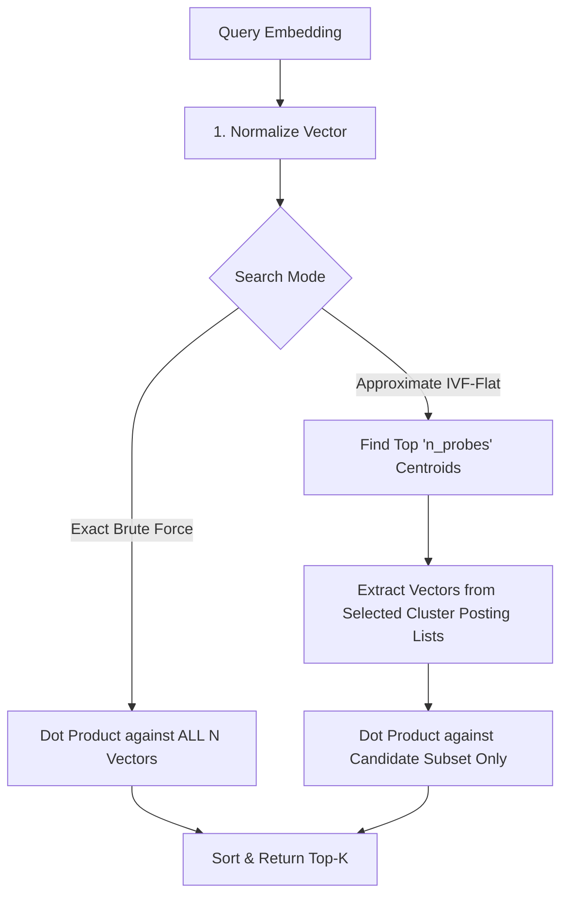

# NumPy Vector Database from Scratch

[](https://www.python.org/downloads/)
[](https://numpy.org/)
[](https://gradio.app/)
[](LICENSE)

A high-performance, lightweight **Vector Database built completely from scratch** using Python and **NumPy**. This project demonstrates how modern vector databases (like Faiss, Milvus, and Pinecone) index and query high-dimensional embeddings—featuring both **Exact Brute-Force Search** (Ground Truth) and **Approximate Nearest Neighbor (ANN) Search** via an **Inverted File (IVF-Flat)** index.

---

## Overview & Architecture

Modern semantic search relies on converting unstructured text/data into dense vector embeddings. Searching millions of high-dimensional vectors with brute force ($O(N)$) is computationally expensive. **IVF-Flat** partitions the vector space into clusters using **K-Means Clustering** and creates inverted lists (posting lists) for each centroid.



### Key Mathematical Foundations
1. **L2 Normalization**: Vectors are pre-normalized to unit length ($\|v\|_2 = 1$). Cosine similarity simplifies to a fast matrix dot product:
   $$\text{Cosine Similarity}(u, v) = u \cdot v$$
2. **K-Means Clustering**: Clusters the dataset into $K$ centroids by iteratively updating centroid positions:
   $$\mu_c = \frac{1}{|S_c|} \sum_{v \in S_c} v$$
3. **Inverted Index (Posting Lists)**: Maps cluster centroid IDs to lists of vector IDs contained within each partition.

---

## Features

-  **Pure NumPy Implementation**: Zero reliance on external indexing libraries (e.g., Faiss, Annoy). All distance calculations, K-Means, and index building are coded manually.
-  **Dual Search Modes**:
  - **Exact Brute-Force**: Ground-truth search comparing against 100% of vectors ($O(N)$).
  - **IVF-Flat Approximate Search**: Sub-linear search probing only candidate clusters ($O(N \cdot \frac{n_{probes}}{K})$).
-  **Full CRUD Operations**:
  - **Insert / Batch Insert**: Pre-normalizes vectors and assigns newly inserted vectors to existing cluster centroids.
  - **Delete**: Safely removes vector embeddings from memory and updates the inverted index posting lists.
-  **Automated Benchmark Suite**: Runs 50,000+ vector benchmarks with 500 queries to compute **Speedup Factor** vs. **Recall@K Accuracy**.
-  **Interactive Gradio Web App**: Live semantic search application using SentenceTransformers (`all-MiniLM-L6-v2`, 384-dimensional embeddings).

---

##  Project Structure

```
vector_db_tina/
├── vector_db.py         # Core Vector Database engine (VectorDatabase class, K-Means, IVF-Flat, Benchmark)
├── app.py               # Gradio Web UI for real-time document insertion and semantic search
├── requirements.txt     # Python dependency specifications (numpy, gradio, sentence-transformers)
├── .gitignore           # Excluded files and directories (venv, __pycache__, logs)
└── README.md            # Comprehensive project documentation
```

---

##  Installation & Setup

### Prerequisites
- Python 3.8 or higher
- Git

### 1. Clone the Repository
```bash
git clone https://github.com/098GauravMalviya/vector_database.git
cd vector_database
```

### 2. Create & Activate Virtual Environment (Optional but recommended)
```bash
# On Windows
python -m venv venv
venv\Scripts\activate

# On macOS/Linux
python3 -m venv venv
source venv/bin/activate
```

### 3. Install Dependencies
```bash
pip install -r requirements.txt
```

---

##  Usage Guide

### 1. Run the Automated Benchmark
Evaluate vector database speedup and recall accuracy on 50,000 synthetic high-dimensional vectors:

```bash
python vector_db.py
```

#### Example Benchmark Output:
```text
Generating synthetic clustered dataset of 50000 vectors (dim=128)...
Generating 500 query vectors...
Inserting vectors into Database...
Building IVF-Flat index (K-Means with 100 clusters)...
Index built in 1.42 seconds.

--- Running Benchmark ---
Running Exact Brute Force Search...
Brute Force took: 0.8520 seconds.
Running Approx IVF-Flat Search (probing top 5 clusters)...
IVF-Flat took: 0.0845 seconds.

Results:
Speedup Factor: 10.08x faster
Recall@10: 94.20% (Accuracy of the approximation)
```

---

### 2. Launch the Gradio Web Application
Start the interactive UI to insert custom documents and run real-time semantic searches:

```bash
python app.py
```
Open your browser at `http://127.0.0.1:7860` to access the interface.

---

##  Python API Reference

```python
import numpy as np
from vector_db import VectorDatabase

# 1. Initialize Database (d = dimension, n_clusters = number of IVF centroids)
db = VectorDatabase(d=384, n_clusters=10)

# 2. Insert Vectors
vector_1 = np.random.randn(384)
v_id = db.insert(vector_1)

# 3. Build IVF-Flat Index
db.build_ivf_index(max_iters=15)

# 4. Search exact (Brute Force)
exact_results = db.brute_force_search(vector_1, top_k=5)

# 5. Search approximate (IVF-Flat)
approx_results = db.ivf_flat_search(vector_1, top_k=5, n_probes=3)

# 6. Delete Vector
db.delete(v_id)
```

---

##  Performance & Trade-Offs

| Search Mode | Time Complexity | Accuracy (Recall) | Recommended Use Case |
| :--- | :--- | :--- | :--- |
| **Brute-Force** | $O(N \cdot d)$ | **100%** (Ground Truth) | Small datasets ($N < 10,000$) or strict accuracy requirements. |
| **IVF-Flat ($n_{probes}=1$)** | $O(\frac{N}{K} \cdot d)$ | ~70% – 85% | Ultra-low latency requirements. |
| **IVF-Flat ($n_{probes}=5$)** | $O(\frac{5N}{K} \cdot d)$ | **~94% – 98%** | Ideal balance of **10x+ speedup** and high recall. |

---

##  Contributing

Contributions, issues, and feature requests are welcome! Feel free to check out the [issues page](https://github.com/098GauravMalviya/vector_database/issues).

---

##  License

This project is licensed under the MIT License - see the [LICENSE](LICENSE) file for details.
